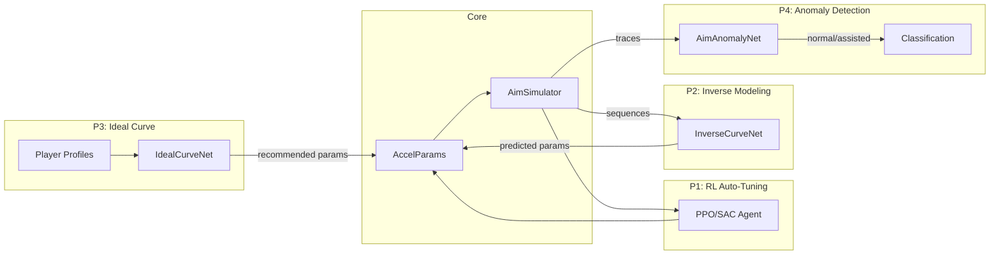

# Mouse Accel ML/RL Suite

A research-style project exploring mouse acceleration for FPS games through four interconnected ML/RL approaches.

## 🎯 Project Goals

| Priority | Idea | Description |
|----------|------|-------------|
| **P1** | RL Auto-Tuning | Reinforcement learning agent that optimises accel curve parameters in a simulated aim environment |
| **P2** | Inverse Modeling | Predict the accel curve being used from observed mouse/view behaviour |
| **P3** | Ideal Curve Learning | Recommend personalised accel curves based on player profiles |
| **P4** | Anomaly Detection | Classify normal vs assisted (aimbot) aim from mouse traces |

## 🏗️ Architecture

All four experiments share a common **acceleration curve parameterisation**:

```
sens(v) = k1 * v^a    for v < v0
sens(v) = k2 * v^b    for v ≥ v0
clamped to [sens_min, sens_max]
```



## 📁 Project Structure

```
├── env/aim_sim/          # Gymnasium aim environment + simulator
│   └── env_core.py       # AimEnv, SimpleAimTask, HumanLikeController
├── models/               # PyTorch model definitions
│   ├── curve_param_config.py   # AccelParams, curve math, utilities
│   ├── inverse_curve_net.py    # LSTM+Attention sequence regressor
│   ├── ideal_curve_net.py      # MLP with constrained output
│   └── aim_anomaly_net.py      # CNN+BiLSTM classifier
├── experiments/          # Training scripts + configs
│   ├── configs/          # YAML experiment configurations
│   ├── rl_auto_tune/     # P1: RL training + evaluation
│   ├── inverse_model/    # P2: data generation + training
│   ├── ideal_curve/      # P3: profile-based training
│   ├── aim_anomaly/      # P4: anomaly detection training
│   └── run_experiments.py  # CLI dispatcher
├── data/                 # Generated datasets (gitignored)
│   └── utils.py          # Shared data loading utilities
├── raw_input/            # Real mouse logging tools
├── notebooks/            # Analysis notebooks
├── docs/                 # Architecture documentation
└── requirements.txt
```

## 🚀 Quick Start

### 1. Install dependencies
```bash
pip install -r requirements.txt
```

### 2. Run experiments

**P1 — RL Auto-Tuning** (highest priority):
```bash
# Train PPO agent to optimise accel params
python -m experiments.rl_auto_tune.train_rl_auto_tune --config experiments/configs/rl_auto_tune.yaml

# Evaluate learned params vs baseline
python -m experiments.rl_auto_tune.evaluate_rl
```

**P2 — Inverse Modeling**:
```bash
# Generate synthetic training data
python -m experiments.inverse_model.gen_synthetic_data --num-curves 2000

# Train inverse model
python -m experiments.inverse_model.train_inverse_model
```

**P3 — Ideal Curve Learning**:
```bash
python -m experiments.ideal_curve.train_ideal_curve
```

**P4 — Anomaly Detection**:
```bash
python -m experiments.aim_anomaly.train_aim_anomaly
```

**Generic dispatcher**:
```bash
python experiments/run_experiments.py --name rl_auto_tune
python experiments/run_experiments.py --config experiments/configs/inverse_model.yaml
```

### 3. Monitor training
```bash
tensorboard --logdir runs/
```

## 📊 Key Metrics

| Experiment | Primary Metrics |
|-----------|----------------|
| P1 RL | Hit rate, time-to-hit, overshoot rate, episode reward |
| P2 Inverse | Parameter MSE, curve L2 distance |
| P3 Ideal | Parameter MSE, sim-in-loop hit rate |
| P4 Anomaly | ROC-AUC, precision, recall, F1, accuracy |

## 🔧 Configuration

All experiments are configured via YAML files in `experiments/configs/`. Key settings:

- **rl_auto_tune.yaml**: PPO/SAC hyperparams, env config (trials, target range, episode length)
- **inverse_model.yaml**: data generation count, model architecture, training schedule
- **ideal_curve.yaml**: profile generator settings, sim-eval toggle
- **aim_anomaly.yaml**: assisted-aim patterns, CNN+LSTM architecture

## 📈 Future Roadmap

- Plug into real PC FPS telemetry (Kovaak's, Aim Lab)
- 2D accel curves (different for tracking vs flicking)
- Meta-RL for few-shot adaptation to new players
- MLP-based curve (small network mapping v → sens, constrained to be smooth/monotonic)
