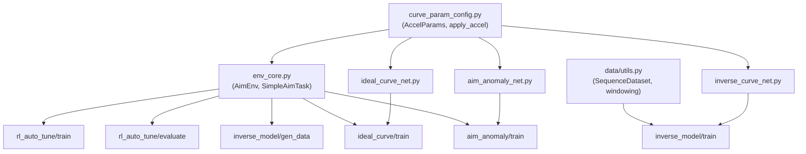
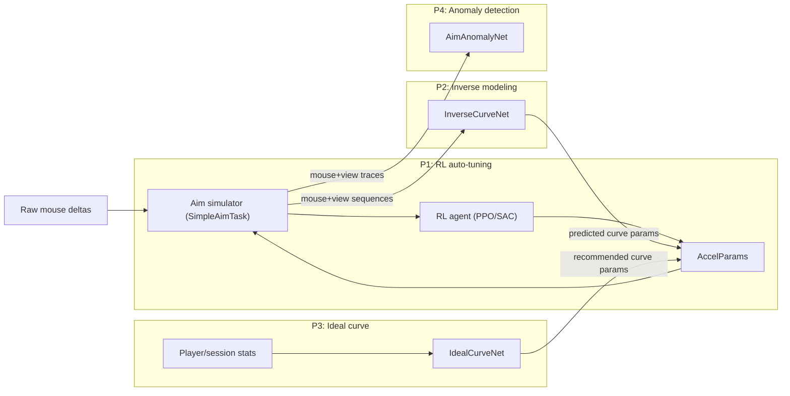

## Mouse Accel ML/RL Suite – Architecture

### 1. Core idea

We model mouse acceleration as a parametric curve mapping mouse speed (counts/s) → sensitivity and use:
- RL to **auto-tune** curve parameters in a simulator.
- Supervised models to **infer** or **recommend** curves.
- A sequence model to **detect anomalies / assist** in aim traces.

All components share the same acceleration parameterisation defined in `models/curve_param_config.py`.

---

### 2. Code structure

- `env/aim_sim/`
  - `env_core.py`
    - `AimEnvConfig`: configures trials, target range, episode length, action scale.
    - `SimpleAimTask`: 1D yaw-only target aiming task with seeded RNG.
    - `AimEnv` (Gym-like): RL environment exposing `reset()` / `step()` for training an RL agent to improve `AccelParams`.

- `models/`
  - `curve_param_config.py`
    - `AccelParams`: dataclass for curve params (`k1, a, k2, b, v0, sens_min, sens_max`).
    - `PARAM_BOUNDS`, `TUNE_KEYS`: per-param ranges and key lists.
    - `sensitivity_from_speed`: maps mouse speed → sensitivity using a 2-branch power curve.
    - `apply_accel`: converts raw mouse deltas to view deltas under a given curve.
    - `params_to_tensor` / `tensor_to_params`: conversion helpers.
    - `normalise_params` / `denormalise_params`: [0,1] normalisation.
    - `sample_random_params`: centralised random parameter sampling.
  - `inverse_curve_net.py`
    - `InverseCurveNet`: BiLSTM sequence-to-vector regressor with optional attention pooling.
  - `ideal_curve_net.py`
    - `IdealCurveNet`: MLP with BatchNorm, dropout, and sigmoid-bounded output.
  - `aim_anomaly_net.py`
    - `AimAnomalyNet`: optional 1D CNN + BiLSTM sequence classifier.

- `experiments/`
  - `configs/`: YAML configuration files for all experiments.
  - `rl_auto_tune/`
    - `train_rl_auto_tune.py`: config-driven PPO/SAC training with ParamLoggingCallback.
    - `evaluate_rl.py`: baseline vs learned params comparison.
  - `inverse_model/`
    - `gen_synthetic_data.py`: generates synthetic data with train/val split.
    - `train_inverse_model.py`: trains with validation, early stopping, curve L2 metric.
  - `ideal_curve/`
    - `train_ideal_curve.py`: correlated synthetic profiles, sim-in-loop evaluation.
  - `aim_anomaly/`
    - `train_aim_anomaly.py`: 3 assisted-aim patterns, ROC-AUC/F1 metrics.
  - `run_experiments.py`: CLI dispatcher.

- `data/`
  - `utils.py`: windowing, normalisation, `SequenceDataset`, `create_dataloaders`.

- `raw_input/`
  - `collector_design.md`: design for real mouse/view logging.
  - `logger.py`: minimal mouse delta logger prototype.

---

### 3. Shared component dependencies

### 4. Data flow overview

